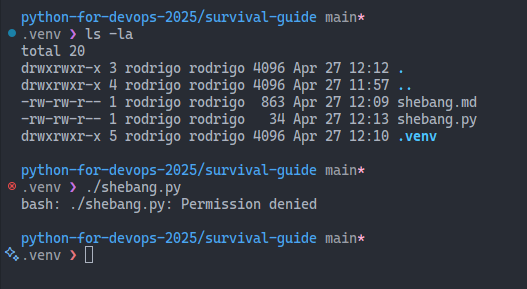

# Creating the virtual environment

To create a virtual environment, you can use the `venv` module that comes with Python. This is a standard way to create isolated Python environments.

```bash
python3 -m venv myenv
```

This command creates a new directory called `myenv` in your current directory, which contains a copy of the Python interpreter and a local version of the Python standard library.

It's a good practice to make the virtual environment directory hidden by prefixing it with a dot. This way, it won't clutter your project directory. You can create a hidden virtual environment like this:

```bash
python3 -m venv .venv
```

You can activate the virtual environment with the following command:

```bash
source myenv/bin/activate
```

Once activated, your shell prompt will change to indicate that you are now working inside the virtual environment. You can now install packages using `pip`, and they will be installed only in this environment.

To deactivate the virtual environment, simply run:

```bash
deactivate
```

This will return you to your system's default Python environment.

# Using a shebang

A shebang is a character sequence at the beginning of a script file that indicates which interpreter should be used to run the script. In Python, the shebang line typically looks like this:

```python
#!/usr/bin/env python3
```

This line tells the system to use the `python3` interpreter located in the user's environment. This is useful for making your script executable without needing to specify the interpreter explicitly.

After adding the shebang, you need to make the script executable:

```bash
chmod +x shebang.py
```

In the image below, we can see that the Python file couldn't be executed directly because it didn't have the executable permission.



To make the script executable, we can use the `chmod` command. The color of the file name will change to green, indicating that it is now executable.


Now you can run your script directly from the command line:

```bash
./shebang.py
```

This will execute the script using the interpreter specified in the shebang line.